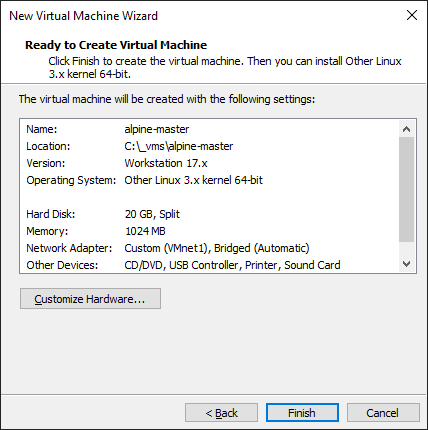

# AlpineLinux Installation und Konfiguration

## ISO
https://www.alpinelinux.org/downloads/

Je nach Architektur der CPU auswählen, normalerweise x86_64

## VM Eigenschaften 

- Minimum Memory: 2048 MB
- Minimum CPU: 2 cores per processor



## AlpineLinux Installation

1. Nach aufstarten der VM Login als root, kein Password
2. mit "*ip a*" herausfinden, welches Interface Bridged/Host-only ist (MAC-Adresse abgleichen)
3. danach setup-alpine - alles Default, ausser siehe unten

|                     | Setting                         | Bemerkung                                                       |
| ------------------- | ------------------------------- | --------------------------------------------------------------- |
| Keyboard            | ch, ch                          |                                                                 |
| Hostname            | master.k8s                      |                                                                 |
| Network ethx        | DHCP                            | für Internet/SSH                                                |
| Network ethx        | 192.168.11.11/24                | zusätzliches Interface für Cluster Kommunukation - Gateway none |
| Timezone            | Europe/Zurich                   |                                                                 |
| Installation Source | f - sucht schnellste Verbindung | Grundsätzlich nr. 32 - eu.edge.kernel.org                       |
| Setup User          | yes                             | Username frei wählbar, wird für SSH gebraucht                   |
| Disk                | sda                             | danach sys                                                      |

### Hosts für Namensauflösung eintragen

Die verwendeten *Kubernetes-Hosts* in `/etc/hosts` eintragen. 

```
--> vi /etc/hosts
192.168.11.11 master.k8s master
192.168.11.12 worker1.k8s worker1
192.168.11.13 worker2.k8s worker2
192.168.11.100 nfsserver
```

### Installation Kubernetes
1. Alle Commands im Root ausführen
2. Repositories ändern, dass community auch enthalten ist. File sollte so aussehen
```
--> vi /etc/apk/repositories
#/media/cdrom/apks
http://eu.edge.kernel.org/alpine/v3.18/main
http://eu.edge.kernel.org/alpine/v3.18/community
http://dl-cdn.alpinelinux.org/alpine/v3.17/main
http://dl-cdn.alpinelinux.org/alpine/v3.17/community
http://dl-cdn.alpinelinux.org/alpine/edge/main
http://dl-cdn.alpinelinux.org/alpine/edge/community
http://dl-cdn.alpinelinux.org/alpine/edge/testing
```
3. Kernel Module für Netzwerk Sachen hinzufügen + Installation Kubernetes
```
echo "br_netfilter" > /etc/modules-load.d/k8s.conf
modprobe br_netfilter
echo 1 > /proc/sys/net/ipv4/ip_forward
apk add cni-plugin-flannel
apk add cni-plugins
apk add flannel
apk add flannel-contrib-cni
apk add 'kubelet=~1.27'
apk add 'kubeadm=~1.27'
apk add 'kubectl=~1.27'
apk add containerd
apk add uuidgen
apk add nfs-utils
```
4. Kubernetes Notwendige Services aktivieren
```
rc-update add containerd
rc-update add rpc.statd
rc-update add kubelet
rc-update add ntpd
service containerd start
service rpc.statd start
service kubelet start
service ntpd start
```
5. Fixes und Kernel Sachen
```
mount --make-rshared /
echo "#!/bin/sh" > /etc/local.d/sharemetrics.start
echo "mount --make-rshared /" >> /etc/local.d/sharemetrics.start
chmod +x /etc/local.d/sharemetrics.start
rc-update add local
uuidgen > /etc/machine-id
ln -s /usr/libexec/cni/flannel-amd64 /usr/libexec/cni/flannel
echo "net.bridge.bridge-nf-call-iptables=1" >> /etc/sysctl.conf
sysctl net.bridge.bridge-nf-call-iptables=1
```
6. Swap deaktivieren, siehe normale Dokumentation
7. VM klonen für worker-node, hierbei müssen eventuell die MAC-Adressen der Netzwerkkarten neugeneriert werden
```
--> vi /etc/hostname
worker1.k8s
```
```
--> vi /etc/network/interfaces
auto lo
iface lo inet loopback

auto eth0
iface eth0 inet dhcp

auto eth1
iface eth1 inet static
        address 192.168.11.12
        netmask 255.255.255.0
```
## Cluster erstellen
```
kubeadm init --pod-network-cidr=10.244.0.0/16 --node-name=$(hostname)
mkdir -p $HOME/.kube
ln -s /etc/kubernetes/admin.conf /root/.kube/config
kubectl apply -f https://raw.githubusercontent.com/flannel-io/flannel/master/Documentation/kube-flannel.yml
```
Anschliessend kann man dem Cluster beitretten mit dem Command den man beim initialisieren erhält.